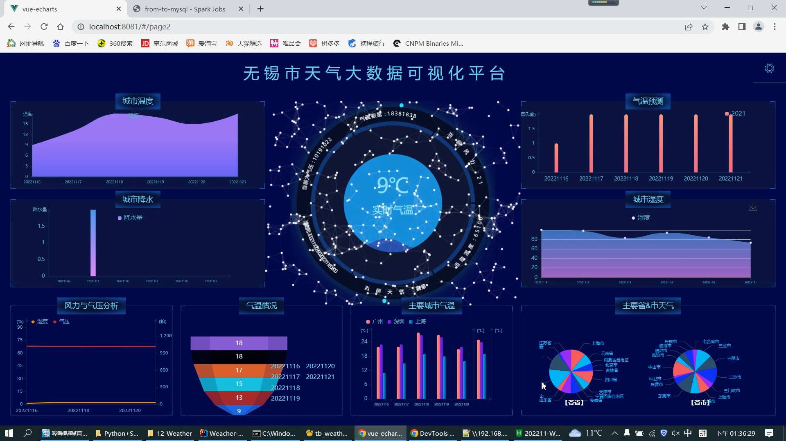
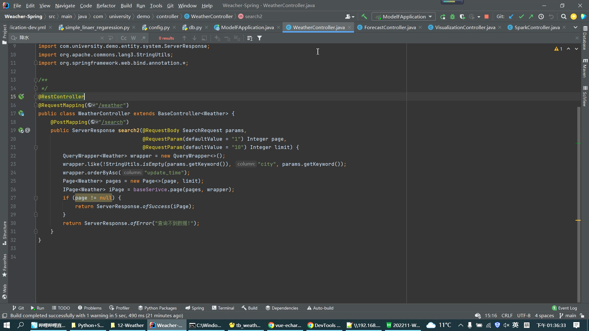
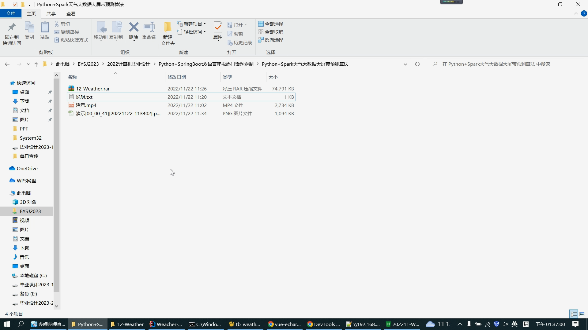
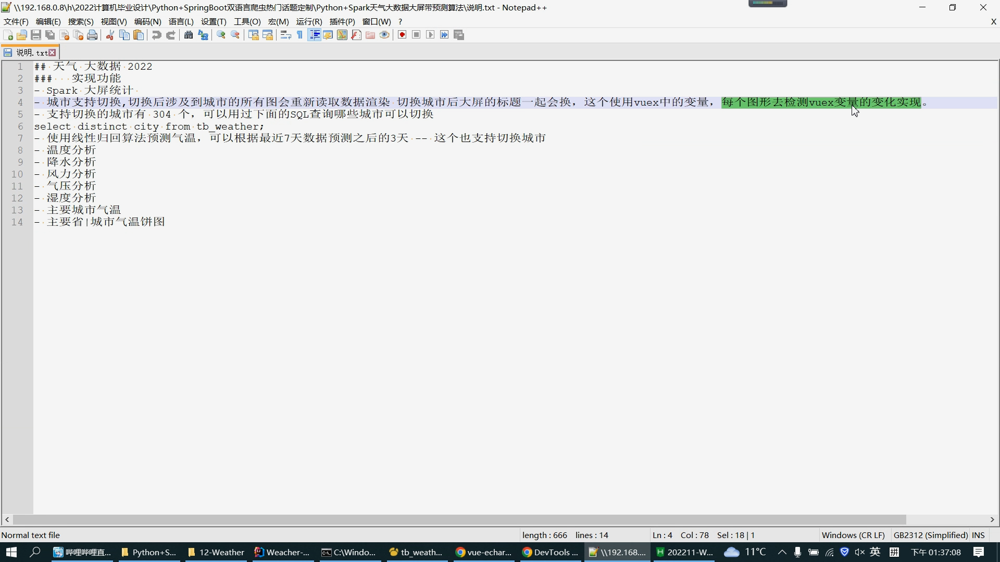
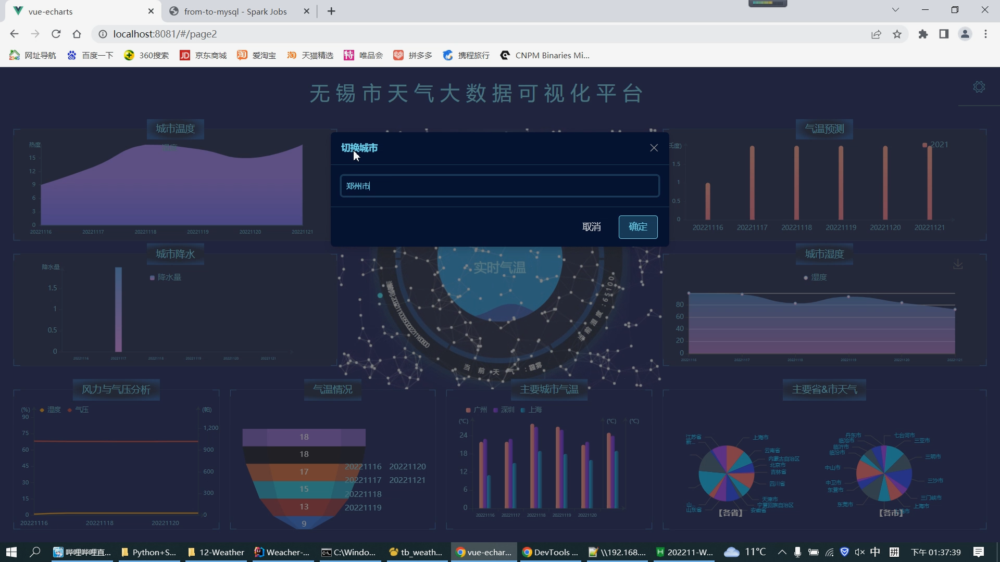
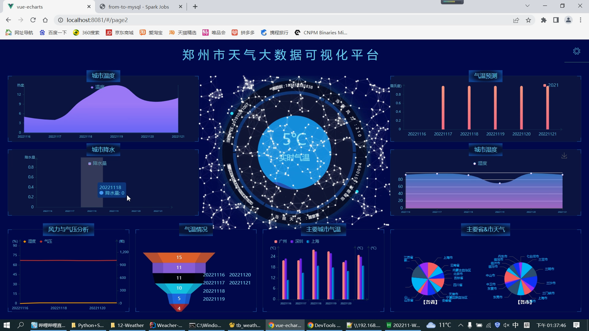
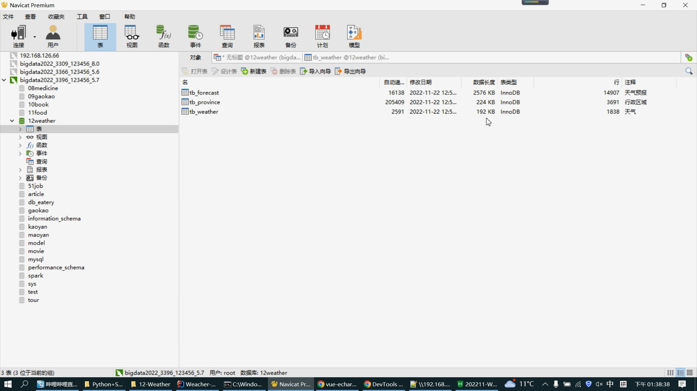
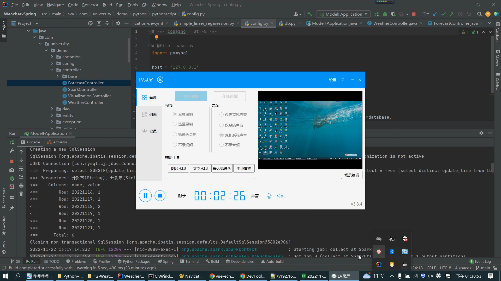
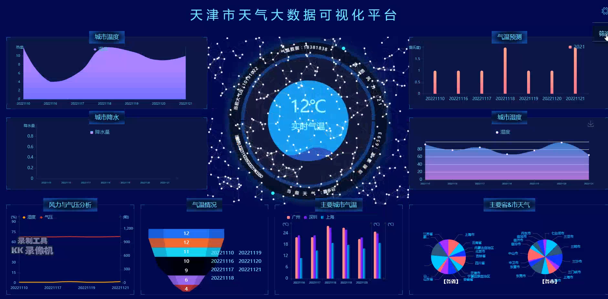

# 计算机毕业设计吊炸天遥遥领先答辩通过Python+Spark机器学习天气预测系统 天气可视化 天气爬虫 天气大数据 天气数据分析 气象数据分析 大数据毕业设计 大数据毕设

## 要求
### 源码有偿一套(论文 PPT 源码+sql脚本+虚拟机)
### 
### 加好友前帮忙start一下，并备注github有偿获取源码
### 我的QQ号是2877135669 

### 或者 微信 bysj2023nb

### 加qq好友说明（被部分  网友整得心力交瘁）：
    1.加好友务必按照格式备注git虚拟机天气预测
    2.避免浪费各自的时间

但是更加吊炸天碾压导师绞杀导师让他无话答辩从头秒到尾的版本可说需要等到2022年12月这个版本

## 开发技术
Python爬虫、线性回归预测算法、Spark实时计算大数据框架、springboot、vue、mysql、echarts

## 天气 大数据 2022
###   实现功能
- Spark 大屏统计 
- 城市支持切换,切换后涉及到城市的所有图会重新读取数据渲染 切换城市后大屏的标题一起会换，这个使用vuex中的变量，每个图形去检测vuex变量的变化实现。
- 支持切换的城市有 304 个，可以用过下面的SQL查询哪些城市可以切换
select distinct city from tb_weather;
- 使用线性归回算法预测气温，可以根据最近7天数据预测之后的3天 -- 这个也支持切换城市
- 温度分析
- 降水分析
- 风力分析
- 气压分析
- 湿度分析
- 主要城市气温
- 主要省|城市气温饼图

## 补充说明
适合大数据毕业设计、数据分析、爬虫类计算机毕业设计

# 运行截图

# 演示视频

https://www.bilibili.com/video/BV1D44y1X7di/?spm_id_from=333.999.0.0